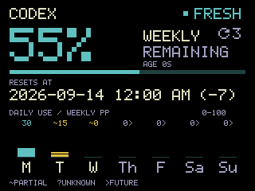
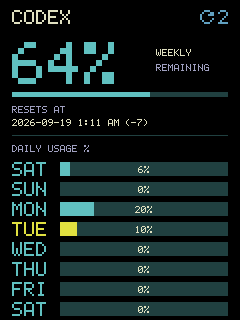

# Codex usage meter

The [native collector](cmd/meter-collector/README.md) publishes weekly snapshots
and 35 days of daily usage history. The [Docker API](cmd/meter-api/README.md) serves them
through authenticated, bounded HTTP reads. The [CYD network client](firmware/README.md)
polls that endpoint over Wi-Fi, validates readings, preserves last-known data on
failure, and advances age while disconnected.

The LCD shows weekly capacity remaining, a horizontal gauge, the source's local
12-hour reset date/time with a parenthesized UTC offset, and calendar-day usage
bars anchored to the current reset period (including both partial reset dates).
The [v2 API](contracts/v2/README.md) keeps at least 35 days of daily aggregates for
future history views. Days without observations show `?`.
Both layouts place the reset counter in the top-right header and label the daily
section `DAILY USAGE %`, with no status, age, or legend. Landscape uses solid
vertical bars with plain whole numbers; portrait uses horizontal bars with whole
percentages. Unknown history shows `?`, and future days show `0` (`0%` in portrait).
Today's weekday and bar are yellow; other known bars use the weekly blue/cyan
color. Landscape also highlights today's number. Both layouts retain the weekly
warning color for stale data and placeholders for missing readings.
The hardware configuration and constrained buffer retain the verified baseline.

Daily values estimate percentage points of weekly allowance consumed, not raw
tokens. Small quota corrections and reset-time changes preserve recorded totals;
correction rebounds are not counted twice. Gaps can leave daily estimates partial.

Tap **CODEX** to rotate the view; the selected orientation survives restart.
Wi-Fi is enabled with disconnect-driven reboots disabled. The API URL, dedicated token and Wi-Fi credentials
belong in ignored `secrets.yaml`; start from `secrets.example.yaml`. Use the Mac's
literal LAN IPv4 address, explicitly bind the API to that address, and use the
same token in the API settings. HTTP is plaintext on the selected trusted LAN.
Read the [security and privacy boundaries](SECURITY.md) before deploying or sharing artifacts.

## Display preview

Rendered directly from the firmware UI with synthetic example data.

| Landscape | Portrait |
| :---: | :---: |
|  |  |

## Install and run

Follow the [macOS installation guide](docs/installation.md) to configure private
settings, build the collector/API, enable login startup, check status, and stop
or uninstall while preserving cycle history. Docker Desktop must be running.

## Hardware

The configuration targets an **ESP32 with 4 MB flash** and an ILI9341-compatible
2.8-inch display in the E32R28T family. Check your board against its
[manufacturer specification](https://www.elecrow.com/download/product/DHO26028B/2.8inch_ESP32-32E_Display_Specification_V1.0.pdf)
and these LCD pins:

| LCD signal | ESP32 pin |
| --- | --- |
| Clock | GPIO14 |
| MOSI | GPIO13 |
| Chip select | GPIO15 |
| Command/data | GPIO2 |
| Backlight, active high | GPIO21 |
| Reset | Shared board EN |

The ESPHome `ESP32-2432S028` preset supplies the matching ILI9341 initialization
and CS/DC pins; this does not imply the PCB is the Micro-USB model. The display
uses 10 MHz SPI, 8-bit color, and a 25% buffer (19,200 bytes). GPIO12/MISO is not
needed for drawing; GPIO33 is touch chip select and must not be used as LCD reset.
No PSRAM is configured. Flash uses DIO at 40 MHz.

## Build and flash

Create private `secrets.yaml` before validating or building. Run these commands
from this repository. The helper finds the installed macOS ESPHome
Device Builder Python automatically. It also accepts `ESPHOME_PYTHON`, a local
`.venv`, or the current Python environment. Tested versions are ESPHome 2026.8.0,
ESP-IDF 5.5.5, and esptool 5.3.1.

```sh
# Optional, for a machine without ESPHome Device Builder:
python3 -m venv .venv
.venv/bin/python -m pip install -r requirements.txt

python3 scripts/firmware.py validate
python3 scripts/firmware.py build
ls /dev/cu.*
python3 scripts/firmware.py flash --port /dev/cu.wchusbserial10
python3 scripts/firmware.py logs --port /dev/cu.wchusbserial10
```

Use the actual device path from your machine. Close other serial monitors before
flashing. The flash command installs the most recent build using ESP-IDF's
generated offsets for the bootloader, partition table, OTA metadata, and app.
It uses **115200 baud** and requires successful esptool hash verification. Build
again after changing source. `verify` performs a separate check of those regions.

If transfers fail, try a short known-good data cable and a direct USB port.
Require successful write verification and a successful boot before accepting a flash.

ESPHome also writes `.esphome/build/codex-meter-1/build/firmware.factory.bin` for
USB installation and `firmware.ota.bin` for OTA-capable firmware. These images are
different; use the helper above to avoid incorrect offsets. This firmware
itself does not receive OTA updates.

## ESPHome Device Builder

The repository is the source of truth. To refresh a local Device Builder
configuration:

```sh
python3 scripts/firmware.py sync-builder --builder-directory "$HOME/esphome"
```

The Builder directory must first have the same private Wi-Fi and meter keys in
its own ignored `secrets.yaml`. This command does not copy secrets.

This backs up the previous dashboard YAML under ignored `artifacts/private/`,
then creates a mirror whose local network/display component points into
this repository.
Open `codex-meter-1.yaml` in Device Builder and refresh the page. Dashboard edits
are not copied back; edit this repository and sync again for subsequent changes.

## Files and diagnostics

- `codex-meter-1.yaml`: hardware, Wi-Fi, network client and heartbeat.
- `firmware/components/meter_network/`: bounded HTTP transport, cached model,
  and a fixed-size bitmap renderer without external font downloads.
- `tests/`: desktop unit/integration tests, contract validation, and native firmware/display checks.
- `scripts/firmware.py`: validate, build, flash, verify, logs, and dashboard sync.
- `scripts/capture_serial.py`: bounded log recording; run with an interpreter
  containing pyserial. `--reset` pulses EN for a fresh boot.
- `artifacts/`: ignored build/flash/boot logs and generated firmware copies.
- `artifacts/private/`: ignored local backups and private diagnostic records.

## Repository layout

| Path | Purpose |
| --- | --- |
| `cmd/`, `internal/` | Go collector and API, shared calendar logic, and Go unit tests. |
| `scripts/` | Install/manage the desktop service, build/flash firmware, and run publication checks. |
| `firmware/`, `codex-meter-1.yaml` | ESPHome component and board configuration. |
| `contracts/` | Versioned protocol schemas and synthetic fixtures used by the tests. |
| `tests/` | Maintained development checks; not required by the running service. |
| `docs/` | Desktop service installation guide and synthetic UI screenshots. |
| `.local/`, `secrets.yaml` | Ignored installation state and private configuration. |
| `.esphome/`, `artifacts/` | Ignored generated builds, optional test output, and private backups. |

Firmware binaries embed Wi-Fi credentials and the meter token. Keep all personal
builds, screenshots, and serial/usage captures private. Publish source and synthetic
examples only.

## Development and license

See [CONTRIBUTING.md](CONTRIBUTING.md) for portable development setup, validation,
and publication scans. The code is available under the [MIT license](LICENSE).
